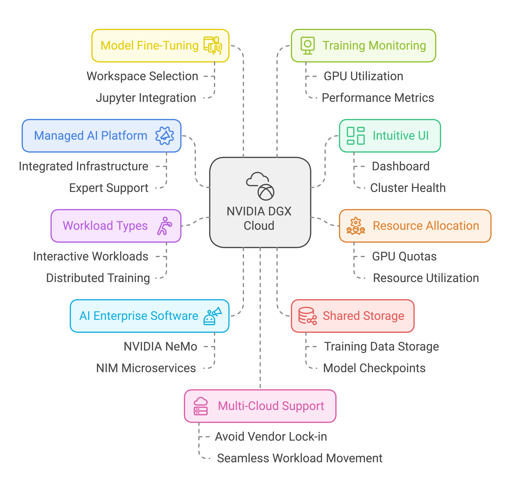
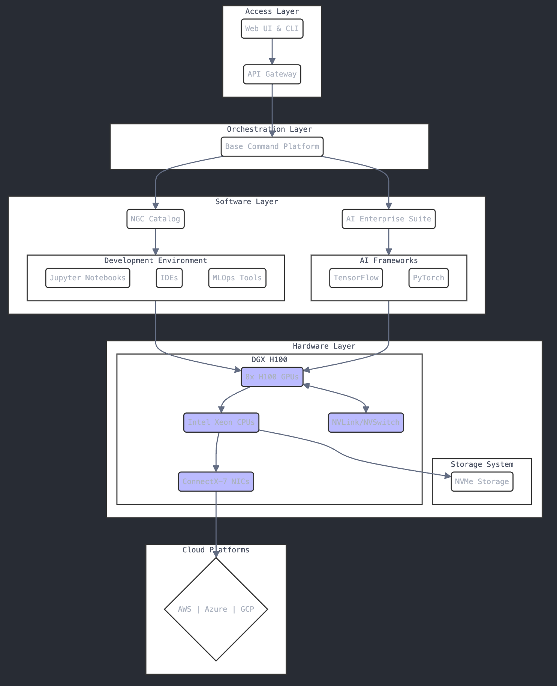
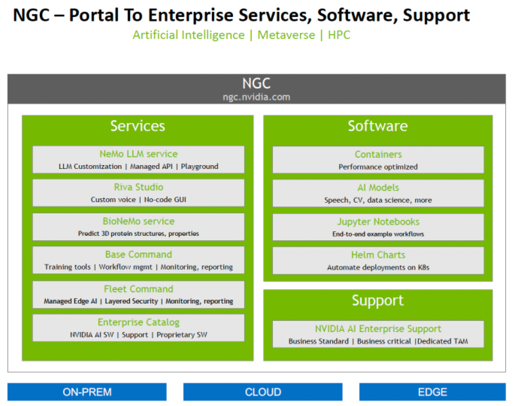

# NVIDIA DGX Cloud Overview

NVIDIA DGX Cloud is a fully managed, high-performance AI platform designed for ease of use and scalability. It offers intuitive management tools, including dashboards for monitoring and resource allocation, enabling efficient utilization of GPUs across multiple users. The platform integrates seamlessly with NVIDIA AI Enterprise software, providing access to crucial resources like NeMo and NIM microservices. High-performance storage facilitates quick access to data and model checkpoints, accelerating the AI development lifecycle. This cloud-based solution allows developers to focus on model training and fine-tuning rather than infrastructure management.

- The DGX Cloud UI is intuitive and features a dashboard providing a comprehensive view of cluster health and usage. It allows users to monitor resource allocation, GPU quotas, and overall system performance.
- DGX Cloud enables efficient resource allocation by allowing administrators to manage and assign GPU quotas to different users. This ensures optimal utilization of resources and prevents any single user from monopolizing the system.
- Users can run both interactive and distributed training workloads. Interactive workloads, like fine-tuning generative AI models, allow for real-time interaction and adjustments. Distributed training workloads, used for large-scale multi-node jobs, leverage the power of multiple GPUs for faster training.
- The NVIDIA AI Enterprise software suite offers access to essential resources such as NVIDIA NeMo and NIM microservices, providing developers with pre-built models and tools to accelerate their AI workflows. It also includes a private registry for secure access to software components.
- DGX Cloud provides high-performance shared storage directly connected to the cluster. This allows users to conveniently store their training data and model checkpoints within the DGX Cloud environment, ensuring quick and easy access.
- To fine-tune a model using an interactive workload, users would first choose "Workspace" and select the NeMo container. Then they select Jupyter as their tool, choose the desired compute resource and storage, and create the workload. Finally, they can access Jupyter through the UI and begin the fine-tuning process within the notebook.
- During the model training process, users can track progress, observe real-time GPU utilization, monitor performance metrics, and access logs to analyze the training process. This comprehensive view allows for efficient debugging and optimization.
- DGX Cloud's multi-cloud support allows organizations to avoid vendor lock-in and maintain flexibility in their cloud strategy. They can choose the best cloud provider for their specific needs and seamlessly move workloads between different environments.
- By providing a pre-configured, optimized platform with immediate access to powerful resources, DGX Cloud eliminates setup time and allows developers to begin training models immediately.

 

## Table of Contents

- [Overview](#overview)
- [Core Infrastructure](#core-infrastructure)
- [Software Architecture](#software-architecture)
- [Platform Specifications](#platform-specifications)
- [Integration and Services](#integration-and-services)
- [Performance Impact](#performance-impact)
- [Support and Deployment](#support-and-deployment)

## Overview

NVIDIA DGX systems represent the pinnacle of AI computing solutions, delivered as pre-built rack systems with comprehensive hardware and software integration. These systems function as complete AI supercomputing factories, eliminating traditional infrastructure challenges while providing scalable solutions for diverse AI workloads. NVIDIA DGX Cloud extends this capability by providing instant access to powerful AI computing infrastructure through a cloud-based platform.

### System Architecture Overview

### Key System Components

The DGX platform integrates several critical components:

#### Hardware Foundation

The system's hardware infrastructure includes:

- 8 NVIDIA H100 Tensor Core GPUs delivering massive parallel processing power
- Intel Xeon processors optimized for CPU-intensive computations
- High-performance NVMe storage enabling rapid data access and processing

#### Software Infrastructure

The software stack comprises:

- NVIDIA Base Command Platform for unified system management
- NVIDIA AI Enterprise software suite powering enterprise AI workflows
- Comprehensive NGC catalog providing AI/ML applications

#### Management Infrastructure

Advanced system management features include:

- Intelligent resource allocation system
- Robust security framework
- Comprehensive performance optimization capabilities

#### Network Architecture

Network components include:

- NVIDIA ConnectX-7 Network Interface Cards
- Optimized high-speed data transfer capabilities
- Enhanced network throughput features

#### Cloud Integration

Multi-cloud support includes:

- AWS infrastructure support
- Microsoft Azure compatibility
- Google Cloud Platform integration
- Seamless cross-platform operations

## Core Infrastructure

### Hardware Integration

#### Factory Integration System

The factory integration system provides a complete pre-built rack solution ensuring optimal component placement and system reliability. Each rack undergoes extensive testing and validation before deployment.

Key features include:

- Custom-designed rack layouts optimized for airflow and maintenance
- Integrated cable management systems with color-coded pathways
- Pre-configured networking with redundant paths
- Factory-tested configurations with baseline reports
- Fully managed: Eliminates the complexities of infrastructure management, allowing users to focus on AI development.
- High-performance infrastructure: Delivers the power of NVIDIA GPUs, high-bandwidth networking, and fast storage for optimal performance.
- Optimized software stack: Includes NVIDIA AI Enterprise, featuring tools like NVIDIA NeMo and NIM microservices, for streamlined AI workflows.
- Intuitive user interface: Provides a comprehensive dashboard for monitoring cluster health, usage, and resource allocation.
- Multi-cloud strategy: Offers flexibility to work across different cloud providers.
- Expert support: Backed by NVIDIA AI experts for proactive assistance and guidance.

#### Computing Components

The computing architecture implements a modular design enabling flexible scaling while maintaining stability.

Technical specifications:

- CPU: Dual-socket Intel Xeon platforms with up to 56 cores per socket
- Memory: 2TB DDR5 RAM per node with ECC support
- Interconnect: PCIe Gen 5 fabric with direct GPU-to-GPU communication
- Management: Integrated BMC with IPMI 2.0 support

### Software Stack Architecture

## Platform Specifications

### DGX System Comparison

| Specifications | [DGX SuperPOD GB200](https://www.nvidia.com/en-us/data-center/dgx-superpod/) | [DGX SuperPOD B200](https://www.nvidia.com/en-us/data-center/dgx-b200/) | [DGX BasePOD](https://www.nvidia.com/en-us/data-center/dgx-basepod/) |
|----------------|-------------------|-------------------|--------------|
| Processing Power | 11.5 exaflops AI (FP4) | 144 petaflops AI (FP4) | Scalable configuration |
| Memory | 1.4TB GPU, 64TB/s bandwidth | 1.4TB GPU | Configuration dependent |
| GPU Setup | 72 Blackwell GPUs, 36 Grace CPUs | 8 Blackwell GPUs | Flexible GPU options |
| CPU | Integrated Grace CPU | Dual 5th Gen Intel Xeon | Multiple options available |
| Networking | Quantum InfiniBand (1,800 GB/s per GPU) | Quantum InfiniBand | QM9700/QM8700 switches |

## NGC Portal Integration

### NGC Services

| Service Category | Components | Key Features |
|-----------------|------------|--------------|
| AI Services | NeMo LLM Service | LLM Customization, Managed API, Development Playground |
| Development | Riva Studio | Custom Voice AI, No-code GUI, Speech Recognition |
| Scientific | BioNeMo | Protein Structure Analysis, Molecular Properties, Research Tools |
| Management | Base Command | Training Tools, Workflow Management, Resource Optimization |

## Performance and Business Impact

| Metric Category | Improvement | Details |
|----------------|-------------|----------|
| System Operations | 60% reduction | Streamlined management and deployment processes |
| Development Productivity | 21% increase | Enhanced development tools and workflows |
| IT Resource Efficiency | 50% improvement | Optimized resource utilization and management |
| AI Training Speed | 9x acceleration | Significantly faster model training cycles |
| System Availability | 99.9% uptime | Enterprise-grade reliability standards |

## Quick Start Guide

For new deployments, follow these steps:

1. Determine your deployment model (on-premises, cloud, or hybrid)
2. Review hardware requirements and specifications
3. Plan your network infrastructure
4. Configure your software stack
5. Implement security best practices

## Support Structure

| Level | Coverage | Features |
|-------|----------|-----------|
| Business Standard | 8x5 support | Basic troubleshooting, Standard updates, Email support |
| Business Critical | 24x7 support | Priority response, Advanced support, Phone/email support |
| Dedicated TAM | Personal support manager | Strategic planning, Optimization services, Direct escalation |

## Best Practices

For optimal system performance:

1. Regular system monitoring and maintenance
2. Proper workload distribution
3. Environmental control optimization
4. Security protocol implementation
5. Regular backup and disaster recovery testing

## Additional Resources

### Official Documentation
- [NVIDIA DGX Documentation Portal](https://docs.nvidia.com/dgx/index.html)
- [DGX Systems User Guide](https://docs.nvidia.com/dgx/dgx-systems-user-guide/index.html)
- [NGC Documentation](https://docs.nvidia.com/ngc/index.html)
- [NVIDIA AI Enterprise Documentation](https://docs.nvidia.com/ai-enterprise/index.html)

### Development Resources
- [NGC Catalog](https://catalog.ngc.nvidia.com/)
- [NVIDIA Developer Resources](https://developer.nvidia.com/data-center)
- [DGX Software Stack Documentation](https://docs.nvidia.com/dgx/dgx-stack/index.html)
- [NVIDIA Base Command Platform Guide](https://docs.nvidia.com/base-command-platform/index.html)

### Support Channels
- [NVIDIA Enterprise Support Portal](https://enterprise.support.nvidia.com/)
- [NVIDIA Developer Forums](https://forums.developer.nvidia.com/)
- [NVIDIA AI Enterprise Support](https://docs.nvidia.com/ai-enterprise/support-overview/index.html)
- [DGX System Support Services](https://www.nvidia.com/en-us/data-center/dgx-systems/support/)

### Training and Education
- [NVIDIA Deep Learning Institute](https://www.nvidia.com/en-us/training/)
- [DGX Administration Courses](https://www.nvidia.com/en-us/training/instructor-led-workshops/dgx-administration/)
- [NGC Training Resources](https://catalog.ngc.nvidia.com/training)
- [AI Enterprise Learning Center](https://www.nvidia.com/en-us/training/ai-enterprise/)

### Community and Updates
- [NVIDIA Data Center Blog](https://blogs.nvidia.com/blog/category/data-center/)
- [NVIDIA AI Technical Blog](https://developer.nvidia.com/blog/)
- [NVIDIA GitHub Repositories](https://github.com/NVIDIA)
- [NGC Container Release Notes](https://docs.nvidia.com/dgx/ngc-container-release-notes/index.html)

### Best Practices and Guidelines
- [DGX Platform Security Guide](https://docs.nvidia.com/dgx/security-best-practices/index.html)
- [NGC Private Registry Guide](https://docs.nvidia.com/ngc/ngc-private-registry-user-guide/index.html)
- [DGX Performance Tuning Guide](https://docs.nvidia.com/dgx/bp-dgx/index.html)
- [AI Enterprise Deployment Guide](https://docs.nvidia.com/ai-enterprise/deployment-guide/index.html)

### Case Studies and White Papers
- [DGX Success Stories](https://www.nvidia.com/en-us/data-center/dgx-customer-success/)
- [AI Enterprise Case Studies](https://www.nvidia.com/en-us/ai-enterprise/success-stories/)
- [Technical White Papers](https://www.nvidia.com/en-us/data-center/resources/)
- [Industry Solutions](https://www.nvidia.com/en-us/industries/)

---

This comprehensive platform enables organizations to implement scalable AI infrastructure with enterprise-grade support, offering solutions from initial deployment through ongoing operations. The integrated software stack ensures optimal performance across all implementation scenarios, from entry-level AI initiatives to large-scale enterprise deployments.
